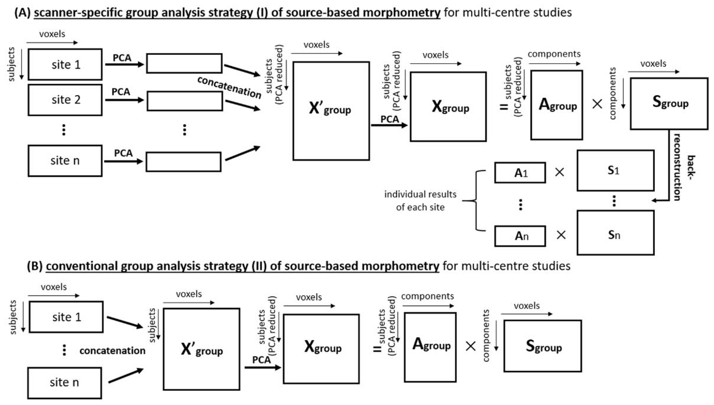

# Source-based morphometry for multi-centre MRI studies
## Project Description

This repository 
We demonstrated that our proposed scanner-specific analysis strategy outperformed the conventional analysis strategy. Therefore, the proposed analysis strategy is recommended when one applies source-based morphometry in a multi-centre MRI study.

## Citation
If you use the simulation code, please cite:"Comparison of Two Source-based Morphometry Analysis Strategies for Multi-Centre Studies: A Simulation Study,
Ruiyang Ge, Shiqing Ding, Tyler Keeling, Sophia Frangoua, Fidel Vila-Rodriguez, In preparation".

## Application 

Neuroimaging research is a collaborative effort, collaborative networks of researchers working together on a range of large-scale studies have been initiated. A prominent issue with a multicentre study is the heterogeneity of the data from scanners with different manufacturers (Siemens, GE, Philips…) and field strength (1.5 T, 3.0 T…).

## Usage
1. To run the simulation, you need to have the SimTB toolbox which you can download from https://trendscenter.org/software/simtb/ or https://github.com/calhounlab/simtb.
2. Download the three m-files from the 'resources' folder, and save them in the same folder. 
3. The file named 'demo_simulation' is the demo to generate 20 datasets which mimic MRI data from 20 different scanners. Please see (TBD) for more details of the parameters.
